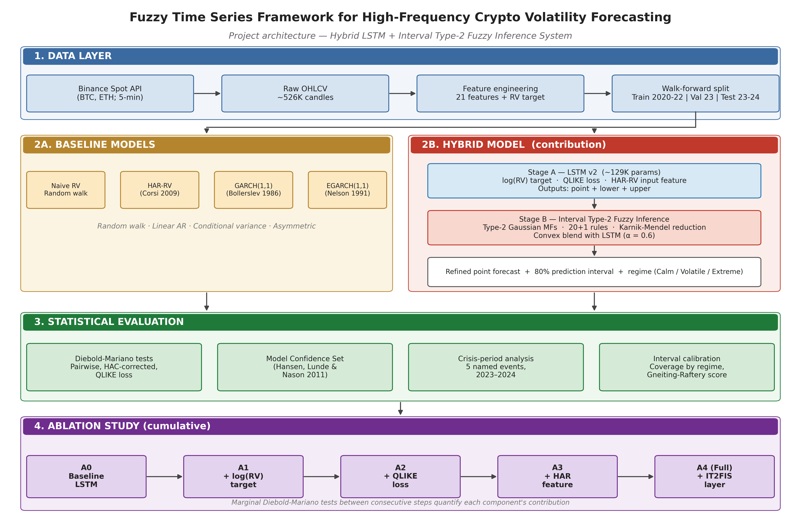

# Fuzzy Time Series Framework for High-Frequency Cryptocurrency Volatility Forecasting

> A hybrid deep learning + Interval Type-2 fuzzy inference system for predicting daily realized volatility of Bitcoin and Ethereum from 5-minute market data.

---

## 1. The Problem We're Solving

Cryptocurrency markets are notoriously hard to forecast. Volatility shifts abruptly between calm and crisis regimes (COVID crash, Terra/Luna collapse, FTX collapse). Two classes of model dominate the literature:

- **Econometric models** (GARCH, HAR-RV): interpretable, statistically grounded, but linear and slow to adapt
- **Deep learning** (LSTM, Transformers): flexible, capture nonlinear patterns, but black boxes with no notion of "what kind of market are we in?"

This project sits in the gap between these two. We combine an **LSTM** (for deep temporal pattern recognition) with an **Interval Type-2 Fuzzy Inference System (IT2FIS)** (for interpretable regime classification and uncertainty-aware prediction intervals). To our knowledge, this specific combination — LSTM + IT2FIS + high-frequency crypto realized volatility — has not been published.

### Research Question
*Can a hybrid LSTM + Interval Type-2 Fuzzy Inference System produce more accurate **and** more interpretable volatility forecasts for high-frequency cryptocurrency markets than traditional econometric models and standalone deep learning alternatives?*

---

## 2. System Architecture



The pipeline has four logical layers:

1. **Data Layer** ingests 5-minute OHLCV data from the Binance API, engineers 21 daily features plus the Realized Volatility target, and applies a strict walk-forward train/validation/test split.

2. **Model Layer** runs in two parallel tracks. Track A trains four econometric baselines (Naive, HAR-RV, GARCH, EGARCH). Track B trains the hybrid model: an LSTM v2 (with log-target transformation, QLIKE loss, and HAR-RV input feature) whose three outputs feed into an Interval Type-2 Fuzzy Inference System that produces the final point forecast, prediction interval, and regime label.

3. **Statistical Evaluation Layer** runs pairwise Diebold-Mariano tests, the Model Confidence Set procedure, crisis-period analysis over five named 2023-2024 events, and interval calibration diagnostics.

4. **Ablation Study** builds the model up cumulatively from a baseline LSTM (A0) through each design choice to the full hybrid (A4), measuring the marginal Diebold-Mariano significance of each step.

---

## 3. Phase-by-Phase Breakdown

### Phase 1 — Data Foundation

**Data source:** Binance Spot API, public `/klines` endpoint, no API key required. Symbols: BTC/USDT and ETH/USDT. Period: 1 Jan 2020 → 31 Dec 2024 at 5-minute intervals (~526,000 candles per symbol).

**Target variable:** Daily Realized Volatility,
$$RV_t = \sum_{i=1}^{N_t} r_{t,i}^2$$
where $r_{t,i}$ is the log return at the i-th 5-minute interval of day $t$, and $N_t \approx 288$ for 24/7 crypto markets. This is the gold-standard non-parametric volatility estimator (Andersen, Bollerslev, Diebold & Labys 2001).

**21 daily features computed:**
- *Volatility lags* (8): `rv_1`, `rv_5`, `rv_22`, rolling 7-day and 30-day mean/std, `log_rv`
- *Technical indicators* (6): RSI(14), MACD components (3), Bollinger Band width, ATR(14)
- *Return measures* (4): daily, absolute, 5-day, 22-day cumulative returns
- *Microstructure* (3): high-low range, log volume, volume-to-20-day-avg ratio

**Walk-forward temporal split (no leakage):**
| Split | Date range | Sequences |
|---|---|---|
| Train | 2020-01-01 → 2022-12-31 | 1,041 |
| Validation | 2023-01-01 → 2023-06-30 | 159 |
| Test | 2023-07-01 → 2024-12-31 | 528 |

The StandardScaler is fitted on training data only. All sequence creation (22-day lookback windows) happens *after* the temporal split.

### Phase 2 — Baselines

Four econometric/statistical baselines:

| Model | Specification | Reference |
|---|---|---|
| Naive RV | $\hat{RV}_{t+1} = RV_t$ | Random walk benchmark |
| HAR-RV | $RV_{t+1} = \beta_0 + \beta_1 RV_t + \beta_2 RV_t^{(w)} + \beta_3 RV_t^{(m)}$ | Corsi (2009) |
| GARCH(1,1) | $\sigma_t^2 = \omega + \alpha \epsilon_{t-1}^2 + \beta \sigma_{t-1}^2$ | Bollerslev (1986) |
| EGARCH(1,1) | $\log \sigma_t^2 = \omega + \alpha\|z_{t-1}\| + \gamma z_{t-1} + \beta \log\sigma_{t-1}^2$ | Nelson (1991) |

All three GARCH-family models use rolling one-step-ahead forecasting on the test set (expanding window).

### Phase 3 — Hybrid Model

**Stage A: LSTM v2**

Architecture (~129K trainable parameters):
- LSTM(128) → Dropout(0.2) → LSTM(64) → Dropout(0.2) → Dense(32) ReLU → Dense(3)
- The 3 outputs are: point forecast, lower 10% quantile, upper 90% quantile

Three design choices distinguish v2 from a vanilla LSTM:

1. **Log-target training:** Network predicts $\log(RV)$ to handle the heavy right skew of realized volatility. Final predictions exponentiated back.
2. **QLIKE loss:** Training objective aligns with the evaluation metric:
   $$\mathcal{L}_{\text{point}} = \frac{1}{N}\sum_t \left[ \log(\hat\sigma_t^2) + RV_t/\hat\sigma_t^2 \right]$$
3. **HAR-RV input feature:** A linear HAR-RV model is fitted on the training set once, and its one-step-ahead forecast becomes the 22nd input feature.

Quantile losses on the lower and upper bounds use pinball loss with $q=0.10$ and $q=0.90$ for the 80% prediction interval. Total loss is a weighted sum (W_point=1.0, W_quantile=0.3).

**Stage B: Interval Type-2 Fuzzy Inference System**

This is the project's distinctive contribution. It takes the LSTM's three outputs plus a rate-of-change feature, and produces a refined prediction + interval + regime label.

*Linguistic variables:*

| Variable | Terms | Source |
|---|---|---|
| Predicted RV level | Low, Medium, High, Extreme | LSTM point output |
| Rate of change | Declining, Stable, Rising, Surging | $(RV_{t-1} - \overline{RV}_{t-5..t-1}) / \overline{RV}_{t-5..t-1}$ |
| LSTM uncertainty | Narrow, Moderate, Wide | LSTM upper − lower |
| Output adjustment | StrongShrink, Shrink, Keep, Expand, StrongExpand | Multiplier on LSTM point |

*Membership functions:* Gaussian Type-2 with footprint of uncertainty,
$$\bar\mu_A(x) = \exp\left(-\frac{1}{2}\left(\frac{x-m}{\sigma_{\text{high}}}\right)^2\right), \quad \underline\mu_A(x) = \exp\left(-\frac{1}{2}\left(\frac{x-m}{\sigma_{\text{low}}}\right)^2\right)$$

The membership of any input is an *interval* $[\underline\mu, \bar\mu]$, encoding meta-uncertainty about the linguistic boundaries themselves. Centers are calibrated from training-data percentiles (Q25, Q50, Q75, Q95).

*Rule base:* 20 IF-THEN rules covering Calm / Volatile / Extreme regimes, plus 1 virtual "default Keep" rule that fires at constant strength (0.3) to anchor ambiguous predictions toward no adjustment.

*Inference:* Product T-norm for AND. Each rule fires with an *interval* of strengths $[\underline{f}, \bar{f}]$.

*Type reduction:* Karnik-Mendel iterative algorithm, implemented from scratch in ~30 lines. Returns interval $[y_L, y_R]$.

*Final output:* Convex blend with the LSTM:
$$\hat{RV}_{\text{final}} = LSTM_{\text{point}} \times \left[\alpha + (1-\alpha) \cdot \frac{y_L + y_R}{2}\right]$$
with $\alpha = 0.6$. This caps the fuzzy layer's influence at $\pm 12\%$, preventing over-correction of an already-accurate LSTM.

### Phase 4 — Statistical Evaluation

| Analysis | What it shows | Source |
|---|---|---|
| Diebold-Mariano matrix | Pairwise significance of QLIKE differences with HAC-corrected variance | Diebold & Mariano (1995) |
| Model Confidence Set | Set of models statistically indistinguishable from the best at α=0.10 | Hansen, Lunde & Nason (2011) |
| Crisis-period analysis | Performance during 5 real events: Aug 2023 selloff, Oct 2023 ETF rally, Jan 2024 ETF approval, Apr 2024 BTC halving, Aug 2024 Yen carry unwind | Custom |
| Interval calibration | Coverage by regime, average width, Gneiting-Raftery interval score | Gneiting & Raftery (2007) |

### Phase 5 — Ablation Study

Five cumulative configurations to isolate each component's contribution:

| ID | Configuration | What's added |
|---|---|---|
| A0 | Baseline LSTM | Vanilla (linear target, MSE loss, no HAR, no fuzzy) |
| A1 | + log(RV) target | Address right-skew |
| A2 | + QLIKE loss | Align training with evaluation |
| A3 | + HAR feature | Econometric prior to deep model |
| A4 | + IT2FIS | The full hybrid |

Diebold-Mariano tests between consecutive rows give the marginal significance of each addition. A4 vs A0 gives the total cumulative significance.

---

## 4. File Organization

The entire project is contained in a single Jupyter notebook with all pipeline cells, and a `data/` directory that stores intermediate and final outputs.

```
project/
├── fuzzy_lstm.ipynb          Complete pipeline — all phases run from this notebook
│
└── data/
    ├── raw/             5-min OHLCV CSVs from Binance
    ├── features/        Daily feature matrices (21 features + RV target)
    ├── processed/       LSTM-ready .npz sequences
    ├── baselines/       Baseline predictions and metrics
    ├── lstm/            Final LSTM v2 predictions
    ├── hybrid/          Final LSTM+IT2FIS predictions
    ├── phase4/          DM matrices, MCS results, crisis tables
    ├── ablation/        Per-configuration predictions and ablation table
    └── plots/           Architecture image + figures
```

Cells in `fuzzy_lstm.ipynb` correspond to the project phases in the order: data download → feature engineering → walk-forward split → baselines → LSTM v2 → IT2 fuzzy layer → statistical evaluation → ablation → plots.

---

## 5. Results

### 5.1 Headline performance (QLIKE, lower is better)

| Model | BTC QLIKE | ETH QLIKE |
|---|---|---|
| Naive RV | −6.084 | −5.922 |
| HAR-RV | −6.216 | −5.857 |
| GARCH(1,1) | −6.311 | −6.016 |
| EGARCH(1,1) | −6.241 | −5.999 |
| LSTM v2 (point only) | −6.326 | −6.086 |
| **LSTM v2 + IT2FIS (Full Hybrid)** | **−6.333** | **−6.088** |

### 5.2 Diebold-Mariano significance — Hybrid vs every other model

**BTC:** Hybrid beats every baseline with statistical significance.

| Hybrid vs | DM stat | p-value | Result |
|---|---|---|---|
| Naive | −2.96 | 0.003 | *** Hybrid wins |
| HAR-RV | −2.65 | 0.008 | *** Hybrid wins |
| GARCH | −3.06 | 0.002 | *** Hybrid wins |
| EGARCH | −2.50 | 0.012 | ** Hybrid wins |
| LSTM-only | −3.14 | 0.002 | *** Hybrid wins |

**ETH:** Hybrid significantly beats classical baselines; tied with EGARCH and LSTM.

| Hybrid vs | DM stat | p-value | Result |
|---|---|---|---|
| Naive | −2.19 | 0.029 | ** Hybrid wins |
| HAR-RV | −7.69 | <0.001 | *** Hybrid wins |
| GARCH | −3.49 | <0.001 | *** Hybrid wins |
| EGARCH | −1.43 | 0.152 | Tied |
| LSTM-only | −0.97 | 0.331 | Tied |

### 5.3 Model Confidence Set (90%)

- **ETH:** Only Hybrid and LSTM survive. All four classical baselines (Naive, HAR-RV, GARCH, EGARCH) are statistically eliminated.
- **BTC:** Hybrid, LSTM, HAR-RV, GARCH, and EGARCH all survive; only Naive is eliminated. The Hybrid achieves the strongest QLIKE (MCS p-value = 1.000).

### 5.4 Interval calibration

**BTC: Hybrid is better calibrated than LSTM-only.**

| Regime | N days | Hybrid coverage | Avg width |
|---|---|---|---|
| Calm | 371 | 76.8% | 0.00107 |
| Volatile | 76 | 82.9% | 0.00202 |
| Extreme | 59 | 81.4% | 0.00227 |
| Overall | 506 | 78.3% (LSTM-only: 78.1%) | 0.00135 (LSTM-only: 0.00139) |

Prediction intervals automatically widen with regime severity while keeping coverage near the 80% target.

**ETH:** Coverage 87.9% (slightly conservative vs 80% target); width 0.00156 — narrower than LSTM-only's 0.00161.

### 5.5 Crisis-period winners (by QLIKE)

| Crisis (2023-2024) | BTC winner | ETH winner |
|---|---|---|
| Aug 2023 selloff | HAR-RV | HAR-RV |
| Oct 2023 ETF rally | HAR-RV | **Hybrid** |
| Jan 2024 ETF approval | **Hybrid** | **Hybrid** |
| Apr 2024 BTC halving | GARCH | LSTM |
| Aug 2024 Yen carry unwind | LSTM | Naive |

The Hybrid wins 1 of 5 BTC crises and 2 of 5 ETH crises outright. In all other crises it places second or third — no single model dominates uniformly across stress events.

### 5.6 Ablation — cumulative ΔQLIKE per design step

| Step | BTC ΔQLIKE | BTC sig | ETH ΔQLIKE | ETH sig |
|---|---|---|---|---|
| A0 → A1 (log target) | **−0.245** | *** | **−0.373** | *** |
| A1 → A2 (QLIKE loss) | −0.034 | n.s. | −0.048 | * |
| A2 → A3 (HAR feature) | +0.044 | ** | −0.000 | n.s. |
| A3 → A4 (IT2FIS) | −0.007 | *** | −0.001 | n.s. |
| **Total A4 vs A0** | **−0.243** | **p=0.0001** | **−0.422** | **p<0.0001** |

The log-target transformation is the single largest contributor on both coins. The HAR feature surprisingly does not improve performance — slightly degrading QLIKE on BTC (p<0.05) and showing no effect on ETH — suggesting that the deep network's auto-regressive features already capture the lag structure HAR is designed to express. The IT2FIS layer contributes statistically significant though numerically small QLIKE improvements; its real value is in the interval calibration and interpretability dimensions.

---

## 6. Reproducibility

- Random seeds fixed (`SEED = 42`) in all scripts
- Walk-forward temporal split with explicit dates
- StandardScaler fitted on training data only, parameters logged
- All hyperparameters at the top of each notebook cell
- Per-configuration predictions saved to disk so figures and tables can be regenerated without re-training

**Environment:**
```
Python 3.10+
pandas, numpy, scipy, scikit-learn
ccxt              (Binance API)
ta                (technical indicators)
statsmodels       (HAR-RV, OLS)
arch              (GARCH family + MCS)
torch             (LSTM)
matplotlib, seaborn  (plots)
```

Install everything:
```bash
pip install ccxt pandas numpy ta scikit-learn statsmodels arch torch scipy matplotlib seaborn
```

**Execution:** Open `fuzzy_lstm.ipynb` in Jupyter and run cells in order from top to bottom. The notebook is organised into sequential pipeline stages (data → baselines → LSTM → fuzzy layer → evaluation → ablation → plots), with each stage's outputs saved to disk so later stages can reload them without re-running earlier work.

---

## 7. Key References

- Andersen, T. G., Bollerslev, T., Diebold, F. X., & Labys, P. (2001). "The distribution of realized exchange rate volatility." *Journal of the American Statistical Association*, 96(453), 42-55.
- Bollerslev, T. (1986). "Generalized autoregressive conditional heteroskedasticity." *Journal of Econometrics*, 31(3), 307-327.
- Corsi, F. (2009). "A simple approximate long-memory model of realized volatility." *Journal of Financial Econometrics*, 7(2), 174-196.
- Diebold, F. X., & Mariano, R. S. (1995). "Comparing predictive accuracy." *Journal of Business & Economic Statistics*, 13(3), 253-263.
- Gneiting, T., & Raftery, A. E. (2007). "Strictly proper scoring rules, prediction, and estimation." *Journal of the American Statistical Association*, 102(477), 359-378.
- Hansen, P. R., Lunde, A., & Nason, J. M. (2011). "The Model Confidence Set." *Econometrica*, 79(2), 453-497.
- Karnik, N. N., & Mendel, J. M. (2001). "Centroid of a type-2 fuzzy set." *Information Sciences*, 132(1-4), 195-220.
- Maciel, L., Ballini, R., & Gomide, F. (2023). "Adaptive fuzzy modeling of interval-valued stream data and application in cryptocurrencies prediction." *Neural Computing and Applications*, 35(10), 7149-7159.
- Nelson, D. B. (1991). "Conditional heteroskedasticity in asset returns: A new approach." *Econometrica*, 59(2), 347-370.
- Patton, A. J. (2011). "Volatility forecast comparison using imperfect volatility proxies." *Journal of Econometrics*, 160(1), 246-256.
- Zadeh, L. A. (1975). "The concept of a linguistic variable and its application to approximate reasoning." *Information Sciences*, 8(3), 199-249.
